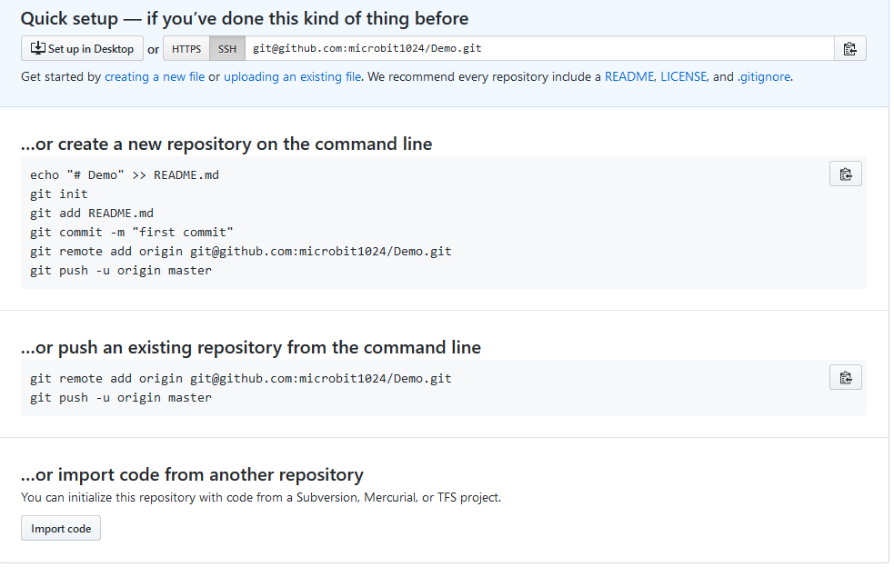

### github使用指北

1、本地Git如何管理两个或多个github账号？

> 每个github账户需要绑定一个基础邮箱，使用对于的基础邮箱生成一个ssh密钥对。
>
> 配置密钥对后，可以使用Git进行版本控制同时push到github repos上。多个账号需要则对进行操作的仓库地址进行区分。
>
> 比如：
>
> git@github.com:microbit1024/Demo.git 是指默认Git账户对Demo仓库进行操作。
>
> git@tsf.github.com:microbit1024/Demo.git 则是指tsf对应的GIt账户对Demo仓库进行操作

2、github仓库push流程

* 可以在github网站上创建好一个仓库，然后clone到本地，然后把需要更新的文件复制进去，然后进行add，commit，以及push操作。
* 也可以在本地先使用git init初始化一个项目，进行add，commit操作后，使用remote获取远程分支，进行push操作
* github提供的例子：

3、如何进行pull request

* 对想要pr的repository进行fork到自己账号
* 然后将repository clone到本地，进行代码创作，之后进行add和commit操作（和提交到自己仓库的操作相同）
* 进入github对应的参考，点击**New pull request**，然后到了compare changes页面，查看一下相关信息，点击**Create pull request**，（添加相关说明）即可
* 最后只用等待内容被merge就行